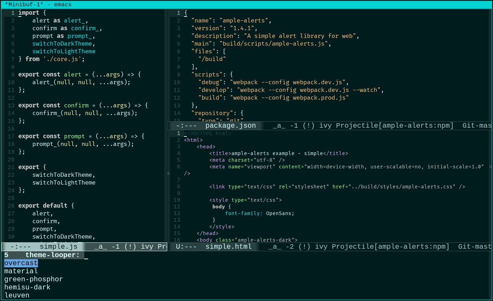

# theme-looper

  

A convenience package to switch themes in Emacs.

> Note: Breaking changes in version 2

## Background

### (You may directly skip to Usage)

Emacs 24 and later comes with a set of pre-installed color-themes that can be enabled by a simple command like:

    M-x load-theme RET wombat
    
The above command enables (rather activates) 'wombat' theme. However, when you get lazy as I did, you need something like theme-looper.el. So, if you have a list of your favorite color-themes and you want to cycle through them with simple keystrokes, you've come to the right place.

## Installation

### Manual

Save the file 'theme-looper.el' to disk and add the directory containing it to 'load-path' using a command in your '.emacs' file like:

    (add-to-list 'load-path "~/.emacs.d/")
    
The above line assumes that you've placed the file into the Emacs directory '.emacs.d'.

Start the package with:

    (require 'theme-looper)

### MELPA-Stable / MELPA / Marmalade

If you have MELPA-Stable, MELPA or Marmalade added as a repository to your Emacs, you can just install *theme-looper* with

    M-x package-install theme-looper RET

## Usage

### Set key-bindings to switch themes like a breeze

    (global-set-key (kbd "C-}") 'theme-looper-enable-next-theme)
    (global-set-key (kbd "C-{") 'theme-looper-enable-previous-theme)
    (global-set-key (kbd "C-\\") 'theme-looper-enable-random-theme)
    (global-set-key (kbd "C-|") 'theme-looper-select-theme)
    (global-set-key (kbd "C-M-|") 'theme-looper-select-theme-from-all)

By the name, functions `theme-looper-enable-next-theme` and `theme-looper-enable-previous-theme` let you move through the list of your favorite color themes. When you have no clue for which theme you would like to be loaded or want to see a random theme every time you start Emacs, you can use `theme-looper-enable-random-theme`.

`theme-looper-select-theme` provides a list of themes to select from using [ivy](https://github.com/abo-abo/swiper/blob/master/ivy.el)'s completion interface. It also tries to provide live feedback according to themes being highlighted, even before one is selected from the list. If you feel like exploring themes outside of the collection of your favorite themes, you can use `theme-looper-select-theme-from-all` and select one from all available themes.

### *Optional:* Set a list of your favorite color themes:

By specifying a particular set of themes

    (theme-looper-set-favorite-themes '(wombat tango-dark wheatgrass))

or using a regular expression

    (theme-looper-set-favorite-themes-regexp "dark")

The special symbol `*default*' represents Emacs defaults (no theme)

    (theme-looper-set-favorite-themes '(cobalt wheatgrass *default*))

### *Optional:* Set a list of ignored themes:

By specifying a particular set of themes

    (theme-looper-set-ignored-themes '(cobalt))

or using a regular expression

    (theme-looper-set-ignored-themes-regexp "green")

### *Optional:* Set both

In this case, only the favorite themes that are not within the ones to be ignored are used.

### More

If you want to reset your color-theme preferences, simply use

    (theme-looper-reset-themes-selection)

You can set hook functions to be run after every theme switch

    (add-hook 'theme-looper-post-switch-hook 'my-func)

## Acknowledgments

Thanks to the below people for their valuable feedback, suggestions, help, and enhancements (in chronological order of contributions):

- [syohex](https://github.com/syohex)
- [protonpopsicle](https://github.com/protonpopsicle)
- [divagant-martian](https://github.com/divagant-martian)
- [romildo](https://github.com/romildo)
- [4goodapp](https://github.com/4goodapp)
- [fishyfriend](https://github.com/fishyfriend)
